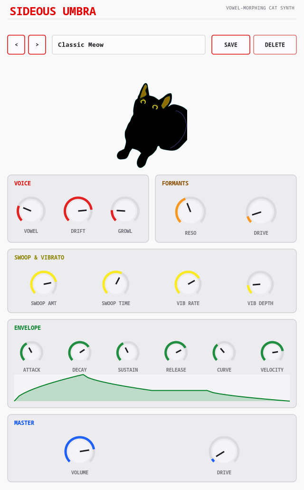

# Sideous Umbra


> **⚠️ VIBE CODED SLOP.** This entire plugin — DSP, GUI, CI — was built through
> conversational back-and-forth with an AI, not hand-engineered from a spec.
> It works, it's been tested, but go in with appropriate expectations.

A small, silly, genuinely playable cat-meow synth (VST3 / LV2 / CLAP / JACK
standalone), built on [DPF](https://github.com/DISTRHO/DPF) with a
hand-drawn Cairo-based UI — the small/joke plugin in the same family as
[Sideous](https://github.com/marcin-koziol/Sideous-synth) and
[Sideous Noise](https://github.com/marcin-koziol/Sideous-noise), sharing
their DSP-building-block conventions (PolyBLEP oscillator, ADSR, zero-delay-
feedback SVF, LFO, xorshift noise) but deliberately kept tiny: 16 parameters,
no preset browser, no LFO-destination routing matrix.



## The idea

Real vowel sounds (and cat meows) get their color from **formants** —
resonant peaks the vocal tract shapes on top of a buzzy source. Sideous
Umbra does the same thing on purpose: a PolyBLEP sawtooth "vocal fold"
(crossfaded with white noise for a rasp/growl texture) drives three parallel
bandpass filters tuned to F1/F2/F3 frequencies interpolated across a
5-point vowel table (ah / eh / ee / oh / oo). Sweep the **Vowel** knob and
the same buzzy source morphs continuously from "ah" to "oo" — that's most
of what makes it sound cat-like rather than synth-like.

The other half of the trick is the **swoop**: every note-on fires a
dedicated two-stage pitch envelope, independent of the amp envelope — glide
up to `+Swoop Amount` semitones over `Swoop Time` seconds, then glide back
down to the note's actual pitch (over a slightly longer fall), then hold.
`Swoop Amount` can go negative too, for a downward whine instead of the
classic upward "mrreow". Combined with a conventional sine vibrato, every
note gets its own little pitch performance instead of sitting flat.

Mascot: **Umbra**, a small black cat drawn curled up viewed from above/
behind, rendered here filled with a rainbow Pride-flag gradient via
`cairo_mask_surface()` — the cat PNG's own colors are discarded, only its
alpha silhouette is used as a stencil for the gradient. It's the visual
centerpiece of the UI, sitting front and center above the panel sections.

## Parameters

**Voice**
- `Vowel` (0–4, continuous ah→eh→ee→oh→oo morph across the F1/F2/F3 table)
- `Growl` (0–1, saw↔noise crossfade in the source)

**Formants**
- `Formant Resonance` (0–1, shared Q across F1/F2/F3)
- `Formant Drive` (0–1, shared input saturation across F1/F2/F3)

**Swoop & Vibrato**
- `Swoop Amount` (±12 semitones, negative = downward whine)
- `Swoop Time` (10ms–1s, rise stage length; fall runs ~35% longer)
- `Vibrato Rate` (0.5–12 Hz)
- `Vibrato Depth` (0–2 semitones)

**Envelope**
- `Amp Attack` / `Amp Decay` / `Amp Sustain` / `Amp Release`
- `Amp Curve` (0 = linear, 1 = analog-style fast-move/slow-settle)
- `Velocity Sens` (0 = velocity ignored, 1 = full response)

**Master**
- `Master Volume`
- `Master Drive` (tanh-crossfade saturation, character control not just a limiter)

8-voice polyphony (deliberately smaller than the 16-voice siblings — this is
the family's small/light plugin), same free-voice → releasing-voice →
oldest-steal voice-stealing priority as Sideous Noise.

## Building

```sh
git clone --recursive <repo-url>
cd sideous-umbra
cmake -S . -B build
cmake --build build -j$(nproc)
```

(If you already cloned without `--recursive`, run
`git submodule update --init --recursive` first.)

Built plugins land in `build/bin/` — `sideous-umbra.vst3`,
`sideous-umbra.lv2`, `sideous-umbra.clap`, and a JACK/native-audio standalone
(`sideous-umbra`).

CI ([`.github/workflows/build.yml`](.github/workflows/build.yml)) builds
Linux, Windows, and macOS (universal) packages on every push and attaches
them to GitHub Releases for tagged versions.
